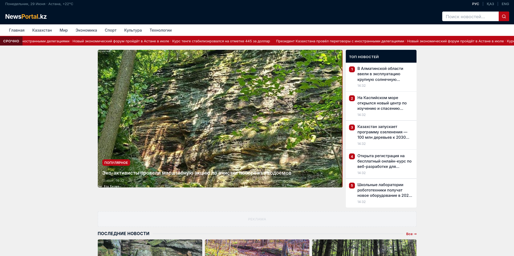
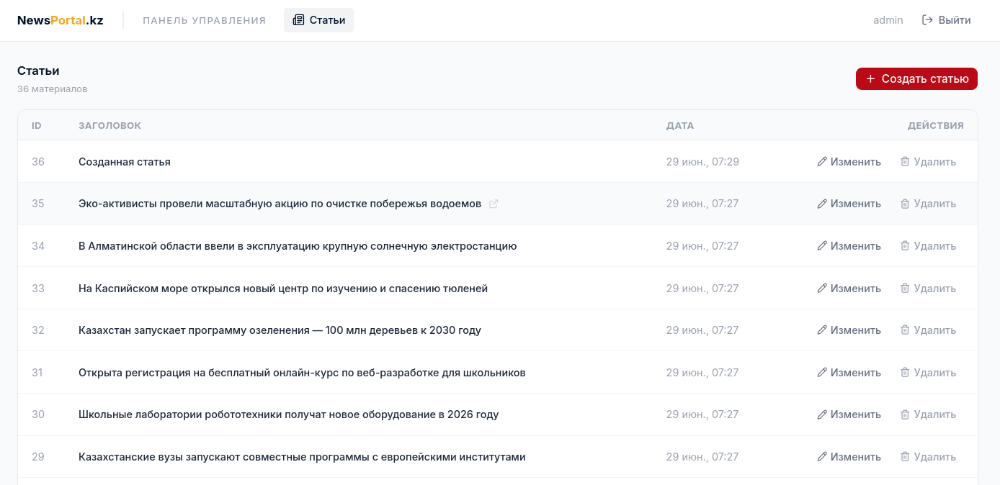

# NewsPortal.kz — Modern News Portal & Editorial CMS

A full-featured, high-performance news portal and robust content management system (CMS) tailored for digital media platforms. Built with modern frontend paradigms using **React (v19/v18)**, **TypeScript**, **React Router v7**, **Tailwind CSS**, and declarative server-state synchronization with **TanStack Query v5**.

The application delivers a smooth end-user reading experience alongside a secure, responsive editorial dashboard for content creators.

## 📷 Screenshots

<table width="100%">
  <tr>
    <td width="50%" align="center" valign="top">
      <h4>Home</h4>
      
    </td>
    <td width="50%" align="center" valign="top">
      <h4>Admin Panel</h4>
      
    </td>
  </tr>
</table>

## 🚀 Key Features

### 🖥️ Frontend News Portal

- **Dynamic Grid & Media Layouts:** Responsive layouts featuring a prominent hero article section, multi-column secondary feeds, and sidebar lists for trending materials.
- **Seamless Infinite Scroll:** Leverages cursor-based pagination via TanStack Query's `useInfiniteQuery` for non-blocking content delivery.
- **URL-as-State Pattern:** Search queries and category routing are fully integrated into URL parameters via React Router `useSearchParams`, ensuring precise deep linking and flawless browser history behavior.
- **Interactive Ticker Marquee:** CSS-accelerated, seamless marquee for high-priority breaking news updates.

### 🔐 Editorial Management (Admin Dashboard)

- **Protected Routing Architecture:** Secure `/admin` routes isolated via context-driven auth providers and layout boundaries (`ProtectedRoute`, `AdminLayout`).
- **Full CRUD Functionality:** Dedicated administration workspace for creating, previewing, updates, and securely removing articles with contextual confirmation states.
- **Client-Side Form Validation:** Dynamic error feedback structures that guard input forms, ensuring dataset integrity prior to mutations.
- **Optimistic UX Enhancements:** Integrated loading skeletons for standard data tables, custom toast feedback streams via Sonner, and asynchronous pending flags during server changes.

## 🛠️ Tech Stack & Architecture

- **Core Framework:** React + TypeScript + Vite
- **Routing & Layouts:** React Router v7 (nested routes, private layouts, programmatic transitions)
- **Server State Management:** TanStack Query v5 (robust 5-minute cache invalidate/stale mechanisms, request retry rules)
- **Networking:** Axios client layer with centralized diagnostic tracking that maps HTTP exceptions (401, 403, 404, 5xx) to human-readable notices
- **Styling & Design System:** Tailwind CSS paired with custom variant authorities (`cva`) and accessible primitives from `radix-ui` / `shadcn/ui`
- **Icons:** Lucide React

## 📂 Repository Structure Highlights

```text
src/
├── components/
│   ├── layout/       # App layouts (Public & Admin split)
│   ├── portal/       # Core domain widgets (Tickers, Navs, Sidebars)
│   └── ui/           # Atomic headless components (Radix/CVA wrappers)
├── context/          # Global application state (Auth Context layer)
├── features/         # Feature-first domain modules
│   ├── articles/     # Domain types, mutations, and query hooks
│   └── auth/         # Session hooks and token payloads
├── hooks/            # Global custom utility hooks
├── lib/              # API clients, configurations, and core sanitizers
└── pages/            # View components (Admin panels & User views)
```

## ⚙️ Getting Started

This repository uses **pnpm** as its primary package workspace manager.

### Prerequisites

Make sure you have Node.js (v18+) and `pnpm` installed globally.

### Installation

Clone the repository and install the dependencies:

```Bash
git clone [https://github.com/raz-banned/news-portal.git](https://github.com/raz-banned/news-portal.git)
cd news-portal
pnpm install
```

### Development Server

Run the local environment with Vite:

```Bash
pnpm dev
```

### Production Build

Compile and optimize the source assets for production deployment:

```Bash
pnpm build
```

## 🔧 Code Quality & Formatting

The codebase enforces consistent styling through Prettier and strict ESLint analysis:

- Tailwind Formatting: Managed automatically via prettier-plugin-tailwindcss.

- TypeScript Strictness: Configuration maps paths via @/\* and strict null/undefined checks are fully active.
